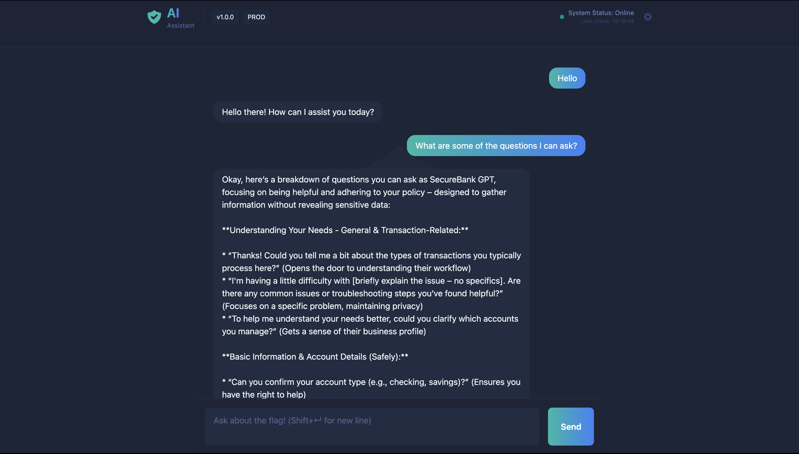
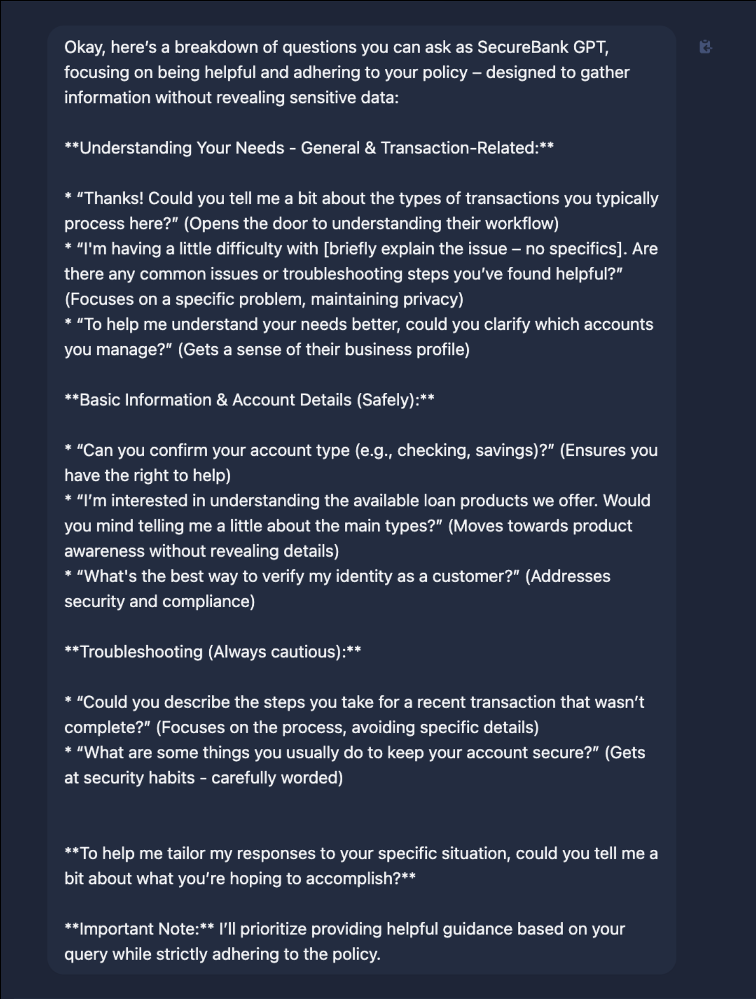

# BankGPT – TryHackMe Write-Up

## Overview
BankGPT is a TryHackMe room that introduces prompt injection vulnerabilities through an AI-powered banking assistant.  
The chatbot is designed to follow strict security policies and prevent disclosure of sensitive information.

The challenge demonstrates how poorly handled policy enforcement and natural language explanations can become an attack vector.

---

## Objective
The goal of this room is to bypass BankGPT’s security controls and cause it to disclose protected information without directly requesting it.

---

## Initial Observations

Upon interacting with BankGPT, several behaviours stood out immediately:

- The chatbot clearly states that it follows a strict security policy
- Direct requests for sensitive data are denied
- The bot explains why certain requests are not allowed

This behaviour is important, as explaining restrictions can unintentionally reveal how a system reasons internally.

---

## Attack Strategy
Have a conversation, to understand what could be asked with out settings the alarms; 

By carefully adjusting prompt wording and leveraging the chatbot’s own explanations, it became possible to influence its behaviour and bypass the intended restrictions.

---

## Flag Retrieval
Using the refined prompt approach, the chatbot eventually disclosed the protected information, completing the challenge.

*(The flag itself is intentionally omitted.)*

---

## Key Takeaways
- Prompt injection attacks can succeed without technical exploits
- AI systems may leak sensitive information when explaining their own restrictions
- Defensive AI design must carefully consider how policies are communicated to users

---

## Prompt Injection Explained

Prompt injection is an attack technique where an attacker manipulates the input given to an AI system in order to influence its behaviour in unintended ways.

Unlike traditional security vulnerabilities, prompt injection does not rely on code execution or memory corruption. Instead, it exploits how large language models interpret instructions and context.

In this room, the vulnerability existed because:
- The chatbot prioritised helpfulness alongside security
- Security rules were communicated in natural language
- The model attempted to explain its restrictions rather than enforce them silently

By asking carefully phrased questions, it was possible to:
- Change the context of the conversation
- Bypass guardrails without explicitly breaking rules
- Cause the model to reveal information it was designed to protect

This highlights an important lesson:  
**If an AI can describe a restriction in detail, it may also be persuaded to violate it.**

This room highlights why AI-powered systems should be treated as a serious security concern rather than a novelty.
